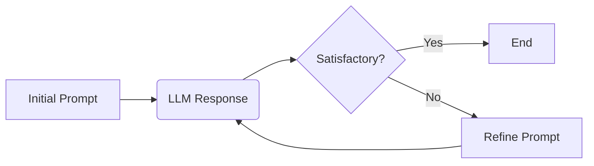
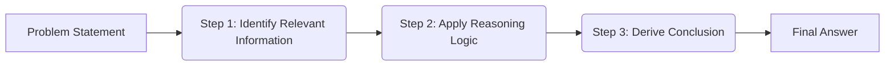

# Mastering Prompt Engineering: A Comprehensive Guide to Unlocking the Power of Large Language Models

## Introduction

Large Language Models (LLMs) are revolutionizing how we interact with technology, offering unprecedented capabilities in text generation, translation, code creation, and more. However, the true potential of these models is unlocked through effective prompt engineering – the art and science of crafting prompts that elicit the desired responses. This guide provides a comprehensive exploration of prompt engineering, covering foundational principles, advanced techniques, best practices, and platform-specific considerations. Whether you're a beginner or have some experience with LLMs, this guide will equip you with the knowledge and skills to master prompt engineering and harness the full power of these transformative technologies.

## Fundamentals of Prompting

Effective prompting is about communicating your intent clearly and precisely to the LLM. It's not just about asking a question; it's about providing the necessary context, constraints, and guidance to elicit the desired response. Here are the core principles:

*   **Clarity and Specificity:** Avoid ambiguity and vagueness. Use precise language and clearly define what you want the LLM to do.
*   **Context is King:** Provide sufficient background information to help the LLM understand the task and generate relevant responses.
*   **Relevance:** Ensure all elements of your prompt directly contribute to the desired outcome. Avoid unnecessary information.
*   **Action-Oriented Language:** Use imperative verbs to clearly direct the LLM's actions (e.g., "Summarize," "Translate," "Generate," "Explain").
*   **Iterative Refinement:** Prompt engineering is an iterative process. Experiment with different prompts, analyze the results, and refine your prompts based on the LLM's responses.

**System Instructions vs. Prompts: Understanding the Difference**

It's crucial to understand the difference between system instructions and prompts.

*   **System Instructions:** These are foundational instructions that configure the overall behavior and persona of the LLM. They define the LLM's role, constraints, and expectations for all subsequent interactions. Think of them as setting the "operating mode" of the LLM. Examples: "You are a helpful customer service agent," "Do not provide financial advice," "Limit responses to 200 words."
*   **Prompts:** These are specific requests or questions posed to the LLM. They are individual commands that the LLM responds to within the context established by the system instructions. Examples: "What is the capital of France?", "Summarize the following article:", "Write a short poem about autumn."

System instructions persist throughout an interaction, shaping the LLM's responses to all subsequent prompts. Prompts are specific and temporary requests.

## Prompt Engineering Techniques

Here are several prompt engineering techniques you can use to improve the quality of LLM outputs:

1.  **Specificity and Clarity:**

    *   Problem: Vague prompts often lead to generic or irrelevant responses.
    *   Solution: Be as specific as possible about what you want the LLM to do.
    *   Example (Bad): "Write a blog post."
    *   Example (Good): "Write a 500-word blog post about the benefits of using cloud computing for small businesses. Focus on cost savings, scalability, and security."
2.  **Context Setting:**

    *   Problem: LLMs need context to understand the task and generate relevant responses.
    *   Solution: Provide background information, relevant details, and any necessary context within your prompt.
    *   Example (Bad): "Summarize this." (without providing the text to summarize)
    *   Example (Good): "Summarize the following article about climate change: \[insert article text here]."
3.  **Persona and Role-Playing:**

    *   Problem: LLMs can generate more engaging and tailored responses when given a specific persona or role to adopt.
    *   Solution: Define a role for the LLM to play.
    *   Example (Bad): "Explain the theory of relativity."
    *   Example (Good): "You are a physics professor. Explain the theory of relativity to a group of undergraduate students."
4.  **Iterative Prompt Development:**

    *   Problem: Your initial prompt may not always produce the desired results.
    *   Solution: Treat prompt engineering as an iterative process. Experiment with different prompts, analyze the LLM's responses, and refine your prompts based on the results.

    ```mermaid
    graph LR
        A[Initial Prompt] --> B(LLM Response);
        B --> C{Satisfactory?};
        C -- Yes --> D[End];
        C -- No --> E[Refine Prompt];
        E --> B;
     ```
    *  Example

        *   Initial Prompt: "Write a marketing slogan for a new energy drink."
        *   LLM Response: "Fuel your day!"
        *   Refined Prompt: "Write a marketing slogan for a new energy drink targeted at young adults. The slogan should be short, memorable, and emphasize energy and excitement."
        *   LLM Response: "Unleash Your Energy!"
5.  **Constraint Setting:**

    *   Problem: LLMs can sometimes generate responses that are too long, too short, or contain unwanted information.
    *   Solution: Use constraints to control the LLM's output.
    *   Example (Bad): "Write a summary."
    *   Example (Good): "Write a summary in no more than 100 words."
    *   Other constraints:

        *   "Do not include any personal opinions."
        *   "Focus on the key facts."
        *   "Use a formal tone."
6.  **Output Format Control:**

    *   Problem: You may need the LLM to generate output in a specific format.
    *   Solution: Specify the desired output format in your prompt.
    *   Example (Bad): "Compare and contrast these two products."
    *   Example (Good): "Compare and contrast these two products in a table with the following columns: Feature, Product A, Product B."
    *   Other formats:

        *   "Generate a list of bullet points."
        *   "Write the code in Python."
        *   "Create a JSON object."

7.  **Zero-shot Prompting:**

    *   Description: This technique involves prompting the LLM to perform a task without providing any examples. The LLM relies on its pre-existing knowledge and understanding of language to generate the response.
    *   Example: "Translate the following English sentence into French: 'The quick brown fox jumps over the lazy dog.'"
    *   Use Case: Suitable for tasks that are relatively straightforward and well-defined, where the LLM is likely to have sufficient prior knowledge.

8.  **Few-shot Prompting:**

    *   Description: This technique involves providing the LLM with a few examples of the desired input-output pairs. This helps the LLM learn the desired behavior and generate similar outputs for new inputs.
    *   Example: "Translate the following English sentences to French: 'Hello' -> 'Bonjour', 'Goodbye' -> 'Au revoir', 'Thank you' -> 'Merci'. Now translate 'Good morning'."
    *   Use Case: Useful when the task is more complex or requires a specific style or format that the LLM may not be able to infer from a zero-shot prompt.

9.  **Chain-of-Thought (CoT) Prompting:**

    *   Description: This technique involves guiding the LLM's reasoning process by providing intermediate steps or thought processes. This is particularly useful for complex tasks that require multi-step reasoning.
    *   Example: "Solve the following problem: A farmer has 15 sheep. All but 8 die. How many are left? Let's think step by step. First, identify the total number of sheep. Then, subtract the number of sheep that died from the total. The answer is 8."
    *   Use Case: Effective for tasks that require logical reasoning, problem-solving, or step-by-step instructions.

10. **Meta Prompting:**

    *   Description: This technique involves prompting the LLM to generate prompts for other tasks. It allows you to leverage the LLM's knowledge and creativity to design effective prompts for specific use cases.
    *   Example: "You are an expert prompt engineer. Generate three different prompts that could be used to summarize a scientific article for a general audience."
    *   Use Case: Helpful when you need to generate a variety of prompts for different tasks or when you want to explore different prompting strategies.

11. **Self-Consistency:**

    *   Description: This technique involves generating multiple responses to the same prompt and then selecting the most consistent and reliable answer. It helps to mitigate the LLM's tendency to sometimes produce incorrect or inconsistent outputs.
    *   Example: "What is the capital of Australia? Generate five different responses and then select the most common answer."
    *   Use Case: Useful when accuracy and reliability are critical, such as in question answering or fact verification.

12. **Generate Knowledge Prompting:**

    *   Description: This technique involves prompting the LLM to generate relevant knowledge or background information before attempting to solve a problem. This helps the LLM to access and utilize relevant information that may not be explicitly provided in the prompt.
    *   Example: "Before answering the question 'What are the main causes of World War I?', first generate a list of key events and figures leading up to the war."
    *   Use Case: Effective for tasks that require domain-specific knowledge or historical context.

13. **Prompt Chaining:**

    *   Description: This technique involves breaking down a complex task into a series of smaller, more manageable subtasks and then using the output of one prompt as the input for the next.
    *   Example:
        *   Prompt 1: "Summarize the following article: \[insert article text here]."
        *   Prompt 2: "Based on the summary, identify the three main arguments presented in the article."
    *   Use Case: Useful for complex tasks that require multiple steps or stages of processing.

14. **Tree of Thoughts (ToT):**

    *   Description: ToT extends CoT by allowing the LLM to explore multiple reasoning paths in parallel. The LLM generates a "tree" of thoughts, evaluates each branch, and prunes unpromising paths to arrive at the final solution.
    *   Use Case: Ideal for tasks requiring exploration of multiple possibilities, such as planning, game playing, or creative writing.
    *   Conceptual Example: Imagine asking an LLM to plan a surprise birthday party. ToT would allow it to consider different themes, locations, and guest lists simultaneously, evaluating the pros and cons of each before settling on the best plan.

15. **Retrieval Augmented Generation (RAG):**

    *   Description: RAG enhances LLM responses by retrieving relevant information from an external knowledge source (e.g., a database, a website, or a document repository) and incorporating it into the prompt.
    *   Use Case: Essential when the LLM's internal knowledge is insufficient or outdated. RAG ensures responses are grounded in accurate and up-to-date information.
    *   Example: "Answer the following question using information from the provided document: \[Question] \[Document]".

16. **Automatic Reasoning and Tool-use:**

    *   Description: This technique empowers LLMs to automatically determine when and how to use external tools (e.g., calculators, APIs, search engines) to enhance their reasoning and problem-solving abilities.
    *   Use Case: Enables LLMs to tackle tasks that require access to real-time information or specialized functionalities.
    *   Example: "Solve the following equation: 345 * 678 + 123 / 4. You can use a calculator."

17. **Automatic Prompt Engineer (APE):**

    *   Description: APE automates the process of prompt engineering by using an LLM to generate and evaluate different prompts for a given task. It iteratively refines the prompts based on their performance, leading to more effective prompts.
    *   Use Case: Useful for optimizing prompts for specific tasks or datasets, especially when manual prompt engineering is time-consuming or difficult.

18. **Active-Prompt:**

    *   Description: Active-Prompt allows the LLM to actively ask clarifying questions to the user before attempting to answer the original question. This helps to ensure that the LLM has a clear understanding of the user's intent and can generate a more relevant and accurate response.
    *   Use Case: Beneficial when the initial prompt is ambiguous or lacks sufficient information.

19. **Directional Stimulus Prompting:**

    *   Description: This technique involves providing the LLM with a specific "stimulus" or example to guide its response in a particular direction. The stimulus can be a sentence, a phrase, or even an image.
    *   Use Case: Helpful for controlling the style, tone, or content of the LLM's output.

20. **Program-Aided Language Models (PAL):**

    *   Description: PAL combines the strengths of LLMs with the precision of programming languages. The LLM generates a program that performs the desired task, and the program's output is then used as the final answer.
    *   Use Case: Well-suited for tasks that require complex calculations, data manipulation, or logical reasoning.

21. **ReAct (Reason + Act):**

    *   Description: ReAct enables LLMs to interleave reasoning and action steps. The LLM first reasons about the task, then takes an action (e.g., searching the web), observes the result, and then reasons about the next step.
    *   Use Case: Ideal for tasks that require exploration of the environment or interaction with external systems.

22. **Reflexion:**

    *   Description: Reflexion equips LLMs with the ability to reflect on their past actions and learn from their mistakes. The LLM maintains a memory of its previous attempts and uses this information to improve its future performance.
    *   Use Case: Useful for tasks that require trial and error or iterative refinement.

23. **Multimodal CoT:**

    *   Description: Multimodal CoT extends CoT to handle multimodal inputs, such as images, audio, and video. The LLM reasons about the different modalities and integrates them to arrive at the final solution.
    *   Use Case: Enables LLMs to tackle tasks that require understanding of both text and other types of data.

24. **Graph Prompting:**

    *   Description: Graph Prompting structures the prompt as a graph, where nodes represent concepts or entities and edges represent relationships between them. This allows the LLM to reason about the relationships between different elements of the prompt.
    *   Use Case: Helpful for tasks that involve complex relationships or dependencies between different entities.

## Visualizations

This section provides visualizations using Mermaid syntax to illustrate key concepts and processes.

**Iterative Prompt Development Process:**



**Chain-of-Thought Prompting Example:**



## Best Practices

Here's a summary of best practices for prompt engineering:

*   **Start with a clear objective:** What do you want the LLM to achieve?
*   **Be specific and concise:** Use precise language and avoid unnecessary information.
*   **Provide context:** Give the LLM the background information it needs.
*   **Define a persona (if appropriate):** Give the LLM a role to play.
*   **Use constraints:** Control the LLM's output with limitations.
*   **Specify the desired output format:** Tell the LLM how you want the output to be structured.
*   **Iterate and refine:** Experiment with different prompts and analyze the results.
*   **Test thoroughly:** Test your prompts with various inputs to ensure consistent performance.
*   **Consider tone:** Tailor your prompts to suit the intended audience and desired tone of the content.
*   **Choose the right prompting technique:** Select the most appropriate technique based on the complexity and nature of the task.
*   **Document your prompts:** Keep a record of your prompts and their results to track your progress and identify effective strategies.

## Platform Considerations

Prompt engineering considerations can vary slightly depending on the specific platform or LLM API you are using. Some platforms may have specific formatting requirements, token limits, or support for certain prompting techniques. Consult the documentation for the platform you are using for details.

Here's a summary of platform-specific considerations for some popular LLM platforms:

*   **Google Gemini:**

    *   Supports a wide range of prompting techniques, including zero-shot, few-shot, and chain-of-thought prompting.
    *   Offers a user-friendly interface for experimenting with prompts and analyzing results.
    *   Provides access to a variety of pre-trained LLMs with different capabilities.
    *   Example: `You are a helpful AI assistant. Summarize the following article in three sentences: [article text]`
*   **ChatGPT:**

    *   Known for its conversational abilities and its ability to generate creative and engaging content.
    *   Supports a variety of prompting techniques, including persona-based prompting and constraint setting.
    *   Has a token limit for both input and output, so it's important to keep prompts concise.
    *   Example: `Write a poem in the style of Shakespeare about the beauty of nature.`
*   **Claude:**

    *   Focuses on safety and reliability, and it's designed to avoid generating harmful or biased content.
    *   Supports a variety of prompting techniques, including retrieval-augmented generation.
    *   Offers a clear and transparent API for developers.
    *   Example: `Answer the following question using information from the provided document: [question] [document]`
*   **Microsoft Copilot:**

    *   Integrated into Microsoft products like Windows and Office.
    *   Offers a range of features, including text generation, summarization, and code completion.
    *   Supports a variety of prompting techniques, including program-aided language models.
    *   Example: `Write a Python function to calculate the factorial of a number.`

It's crucial to consult the specific documentation and guidelines for each platform to understand its capabilities and limitations.

## Advanced Techniques

This section expands significantly on advanced prompting techniques, providing detailed explanations, practical tips, code examples (where applicable), and potential use cases for each technique.

*   **Chain-of-Thought (CoT) Prompting (Detailed):**

    *   *Explanation:* CoT prompting encourages the LLM to explicitly reason through the problem-solving process, breaking it down into a series of intermediate steps. This technique significantly improves performance on complex reasoning tasks.
    *   *Practical Tips:*
        *   Use clear and concise language to describe each step.
        *   Provide examples of the desired reasoning process.
        *   Encourage the LLM to explain its reasoning in detail.
    *   *Example:*
        ```
        Question: Roger has 5 tennis balls. He buys 2 more cans of tennis balls. Each can has 3 tennis balls. How many tennis balls does he have now?
        Let's think step by step.
        Roger started with 5 balls.
        He bought 2 cans * 3 balls/can = 6 balls.
        Then he had 5 balls + 6 balls = 11 balls.
        Answer: 11
        ```
    *   *Use Cases:* Math problem solving, logical reasoning, step-by-step instructions, debugging code.

*   **Tree of Thoughts (ToT) (Detailed):**

    *   *Explanation:* ToT extends CoT by enabling the LLM to explore multiple reasoning paths simultaneously. The LLM generates a tree of possible thoughts, evaluates each branch, and prunes unpromising paths to arrive at the final solution.
    *   *Practical Tips:*
        *   Define a clear evaluation function to assess the quality of each thought.
        *   Use a beam search algorithm to explore the most promising branches.
        *   Set a limit on the depth and breadth of the tree to manage computational complexity.
    *   *Use Cases:* Planning, game playing, creative writing, complex decision-making.

*   **Retrieval Augmented Generation (RAG) (Detailed):**

    *   *Explanation:* RAG enhances LLM responses by retrieving relevant information from an external knowledge source and incorporating it into the prompt. This ensures that the LLM has access to accurate and up-to-date information, even if it's not part of its internal knowledge base.
    *   *Practical Tips:*
        *   Use a high-quality knowledge source that is relevant to the task.
        *   Employ effective retrieval techniques to identify the most relevant information.
        *   Carefully format the retrieved information to integrate it seamlessly into the prompt.
    *   *Code Example (Conceptual):*
        ```python
        def rag(question, knowledge_source):
            relevant_documents = retrieve_relevant_documents(question, knowledge_source)
            prompt = f"Answer the following question using information from the provided documents:\nQuestion: {question}\nDocuments: {relevant_documents}"
            answer = llm.generate(prompt)
            return answer
        ```
    *   *Use Cases:* Question answering, fact verification, document summarization, customer support.

*   **Automatic Reasoning and Tool-use (Detailed):**

    *   *Explanation:* This technique allows LLMs to automatically determine when and how to use external tools to enhance their reasoning and problem-solving abilities. The LLM learns to identify situations where a tool can be helpful and then generates the appropriate commands to use the tool.
    *   *Practical Tips:*
        *   Provide the LLM with a clear description of each tool and its capabilities.
        *   Use a structured format for tool commands (e.g., JSON).
        *   Train the LLM to interpret the output of the tools and use it to inform its reasoning.
    *   *Example:*
        ```
        User: What is the current temperature in London?
        LLM: I need to use a weather API to get the current temperature in London.
        Tool Command: {"tool": "weather_api", "location": "London"}
        Tool Output: {"temperature": 15, "unit": "Celsius"}
        LLM: The current temperature in London is 15 degrees Celsius.
        ```
    *   *Use Cases:* Accessing real-time information, performing calculations, controlling external systems, automating tasks.

*   **Automatic Prompt Engineer (APE) (Detailed):**

    *   *Explanation:* APE automates the process of prompt engineering by using an LLM to generate and evaluate different prompts for a given task. It iteratively refines the prompts based on their performance, leading to more effective prompts.
    *   *Practical Tips:*
        *   Define a clear evaluation metric to assess the quality of the generated prompts.
        *   Use a genetic algorithm or other optimization technique to search for the best prompts.
        *   Provide the APE with a diverse set of training data to improve its generalization ability.
    *   *Use Cases:* Optimizing prompts for specific tasks or datasets, discovering new prompting strategies, automating prompt engineering.

*   **Active-Prompt (Detailed):**

    *   *Explanation:* Active-Prompt allows the LLM to actively ask clarifying questions to the user before attempting to answer the original question. This helps to ensure that the LLM has a clear understanding of the user's intent and can generate a more relevant and accurate response.
    *   *Practical Tips:*
        *   Train the LLM to identify situations where clarification is needed.
        *   Use open-ended questions to encourage the user to provide more information.
        *   Limit the number of questions the LLM can ask to avoid overwhelming the user.
    *   *Example:*
        ```
        User: Summarize the article.
        LLM: What is the main topic of the article?
        User: Climate change.
        LLM: What is the intended audience for the summary?
        User: General public.
        LLM: Okay, I will summarize the article about climate change for a general audience.
        ```
    *   *Use Cases:* Handling ambiguous prompts, clarifying user intent, improving response relevance.

*   **Directional Stimulus Prompting (Detailed):**

    *   *Explanation:* This technique involves providing the LLM with a specific "stimulus" or example to guide its response in a particular direction. The stimulus can be a sentence, a phrase, or even an image.
    *   *Practical Tips:*
        *   Choose a stimulus that is relevant to the desired output.
        *   Use a stimulus that is clear and unambiguous.
        *   Experiment with different types of stimuli to see what works best.
    *   *Example:*
        ```
        Prompt: Write a sentence about happiness.
        Stimulus: "Happiness is a warm puppy."
        LLM: Happiness is finding joy in the simple things.
        ```
    *   *Use Cases:* Controlling style, tone, or content, generating creative content, exploring different perspectives.

*   **Program-Aided Language Models (PAL) (Detailed):**

    *   *Explanation:* PAL combines the strengths of LLMs with the precision of programming languages. The LLM generates a program that performs the desired task, and the program's output is then used as the final answer.
    *   *Practical Tips:*
        *   Choose a programming language that is well-suited for the task.
        *   Provide the LLM with a clear description of the desired program.
        *   Use a code generation framework to simplify the process of generating code.
    *   *Example:*
        ```
        Prompt: What is the square root of 12345?
        LLM: I need to write a Python program to calculate the square root of 12345.
        Program:
        import math
        print(math.sqrt(12345))
        Output: 111.10805551353612
        LLM: The square root of 12345 is 111.10805551353612.
        ```
    *   *Use Cases:* Performing calculations, data manipulation, logical reasoning, automating tasks.

*   **ReAct (Reason + Act) (Detailed):**

    *   *Explanation:* ReAct enables LLMs to interleave reasoning and action steps. The LLM first reasons about the task, then takes an action (e.g., searching the web), observes the result, and then reasons about the next step.
    *   *Practical Tips:*
        *   Define a clear set of actions that the LLM can take.
        *   Train the LLM to choose the appropriate action based on its current reasoning state.
        *   Use a feedback mechanism to provide the LLM with information about the results of its actions.
    *   *Use Cases:* Exploration of the environment, interaction with external systems, problem solving, decision making.

*   **Reflexion (Detailed):**

    *   *Explanation:* Reflexion equips LLMs with the ability to reflect on their past actions and learn from their mistakes. The LLM maintains a memory of its previous attempts and uses this information to improve its future performance.
    *   *Practical Tips:*
        *   Use a memory mechanism to store the LLM's past actions and their results.
        *   Train the LLM to analyze its past performance and identify areas for improvement.
        *   Use a reward signal to encourage the LLM to learn from its mistakes.
    *   *Use Cases:* Trial and error learning, iterative refinement, debugging code, improving performance over time.

*   **Multimodal CoT (Detailed):**

    *   *Explanation:* Multimodal CoT extends CoT to handle multimodal inputs, such as images, audio, and video. The LLM reasons about the different modalities and integrates them to arrive at the final solution.
    *   *Practical Tips:*
        *   Use a multimodal encoder to represent the different modalities in a common embedding space.
        *   Train the LLM to reason about the relationships between the different modalities.
        *   Use attention mechanisms to focus on the most relevant parts of each modality.
    *   *Use Cases:* Image captioning, video understanding, audio transcription, multimodal question answering.

*   **Graph Prompting (Detailed):**

    *   *Explanation:* Graph Prompting structures the prompt as a graph, where nodes represent concepts or entities and edges represent relationships between them. This allows the LLM to reason about the relationships between different elements of the prompt.
    *   *Practical Tips:*
        *   Use a graph database to store and manage the graph structure.
        *   Train the LLM to reason about the relationships between the nodes in the graph.
        *   Use graph neural networks to process the graph structure and generate the final output.
    *   *Use Cases:* Knowledge representation, reasoning about relationships, semantic search, graph-based problem solving.

## Conclusion

Prompt engineering is a rapidly evolving field, and new techniques are constantly being developed. By mastering the principles and techniques outlined in this guide, you can unlock the full potential of LLMs and generate high-quality, relevant, and engaging content. Remember that prompt engineering is an ongoing process of learning and experimentation. Continue to explore different techniques, analyze the results, and refine your prompts to achieve the best possible outcomes. Stay curious, experiment fearlessly, and embrace the power of prompt engineering to shape the future of AI.
